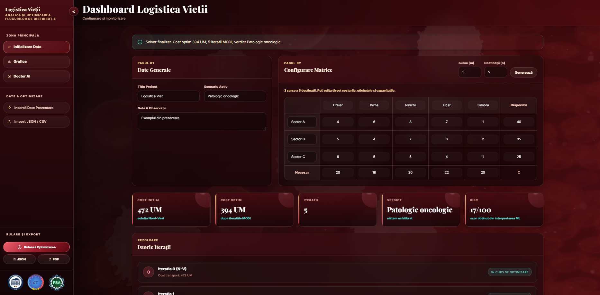
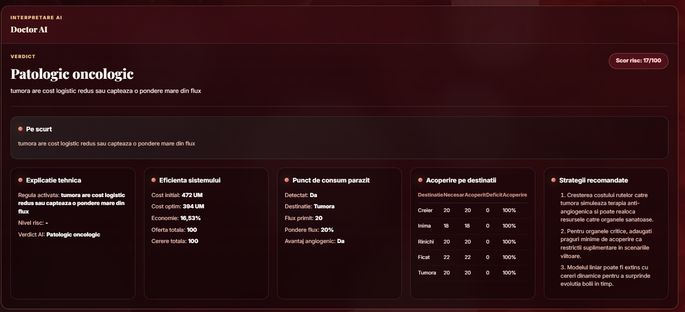

# 🩸 Logistica Vieții — Analiza și Optimizarea Fluxurilor de Distribuție


> 🧠 Model de optimizare inspirat din problema de transport, adaptat pentru tema **Logistica Vieții**  
> 🩸 Fluxuri • Rețea • Optimizare • Interpretare vizuală

# PROIECT_SCSS 
---

## 🖼️ Demo

<p align="center">
  
  
</p>

Aplicația include două moduri de utilizare:

- 🖥️ **interfață desktop** pentru lucru clasic, pas cu pas
- 🌐 **dashboard web** pentru analiză vizuală, grafice și export rapid

---

## 📚 Conținut

### 🔴 1. Motor de optimizare []
- ✔️ Rezolvare a problemei de transport
- ✔️ Soluție inițială prin **Metoda Coltului Nord-Vest**
- ✔️ Calcul iterativ al costurilor marginale `delta`
- ✔️ Identificarea circuitelor de compensare
- ✔️ Tratarea cazurilor degenerate cu perturbare `epsilon`
- ✔️ Echilibrare automată prin sursă sau destinație fictivă

### 🧪 2. Analiză și interpretare []
- ✔️ Istoric complet al iterațiilor
- ✔️ Interpretare explicativă a soluției finale
- ✔️ Scor de risc și verdict final
- ✔️ Evidențiere a acoperirii destinațiilor
- ✔️ Detectarea punctelor de consum dominante din rețea

### 📈 3. Vizualizare blood-themed []
- ✔️ Dashboard web cu identitate vizuală crimson / blood
- ✔️ Grafic pentru evoluția costului total
- ✔️ Grafic pentru acoperirea destinațiilor
- ✔️ Hartă pentru rutele active și fluxurile distribuite
- ✔️ Carduri de sinteză cu indicatori cheie

### 📦 4. Export și lucru cu date []
- ✔️ Import din `JSON`, `CSV` și `TXT`
- ✔️ Export rezultate în `JSON`
- ✔️ Export raport complet în `PDF`
- ✔️ Suport pentru metadate: titlu, scenariu, note, etichete

---

## 🚀 Cum rulezi proiectul?

### 🌐 Varianta web

Pe Windows:

```bash
.\start.bat
```

Pe Linux / macOS:

```bash
bash start.sh
```

Dashboardul va porni pe:

```text
http://127.0.0.1:8000/
```

### 🖥️ Varianta desktop

```bash
py -3 main.py
```

sau

```bash
python3 main.py
```

### 📥 Instalare manuală dependențe

```bash
pip install -r requirements.txt
```

---

## 🧬 Structura proiectului

```text
SCSS/
│
├── core/
│   ├── data_io.py          # import, export, validare, interpretare, PDF
│   ├── epsilon_math.py     # aritmetică epsilon pentru cazuri degenerate
│   └── solver.py           # algoritmul principal al problemei de transport
│
├── ui/
│   ├── app.py              # aplicația desktop în CustomTkinter
│   ├── graph_view.py       # generare grafice analitice
│   └── table_view.py       # randare tabele și iterații
│
├── utils/
│   └── cycle_finder.py     # identificare circuit de compensare
│
├── web/
│   ├── index.html          # structură dashboard web
│   ├── styles.css          # stilizare crimson / blood theme
│   └── app.js              # logică frontend și randare vizuală
│
├── webapp.py               # server local pentru interfața web
├── main.py                 # entrypoint pentru aplicația desktop
├── start.bat               # pornire rapidă pe Windows
├── start.sh                # pornire rapidă pe Linux / macOS
├── requirements.txt        # biblioteci necesare
└── exemplu_import_logistica_vietii.json
```

---

## 🧾 Formatul datelor de intrare

Aplicația așteaptă, în esență:

- matrice de costuri
- valori de disponibil pentru surse
- valori de necesar pentru destinații
- opțional: titlu, scenariu, note și etichete personalizate

Sunt acceptate denumiri precum:

- `cost_matrix`, `matrice_costuri`, `cost`
- `supply`, `disponibil`, `oferta`
- `demand`, `necesar`, `cerere`
- `source_labels`, `surse`
- `destination_labels`, `destinatii`

---

## 📊 Ce oferă aplicația la final?

După rulare, proiectul poate afișa:

- 🔢 numărul de iterații
- 💸 costul inițial și costul optim
- 🧭 alocările pe fiecare rută
- 🧮 potențialele `u` și `v`
- 📉 costurile marginale `delta`
- 🔁 circuitul de compensare
- 🧠 verdictul interpretării
- 🚨 scorul de risc
- 📄 recomandări finale

---

## 🛠️ Tech Stack

- 🐍 Python
- 📊 NumPy
- 🖥️ CustomTkinter
- 📈 Matplotlib
- 📄 ReportLab
- 🌐 HTML / CSS / JavaScript
- 🧰 `http.server` pentru serverul local

---

## 🩸 Observații

- interfața web este gândită pentru prezentare vizuală și analiză rapidă
- interfața desktop este potrivită pentru urmărirea tehnică a pașilor solverului
- dacă problema nu este echilibrată, aplicația introduce automat o entitate fictivă
- dacă apare degenerare, algoritmul folosește perturbare cu `epsilon`

---

## License

Copyright (c) 2026 Adrian Vlad. All rights reserved.

This repository is made publicly available for portfolio and demonstration purposes only.

No part of this codebase may be copied, modified, distributed, reused, incorporated into other projects, or submitted for academic/commercial purposes without explicit written permission from the author.

---

## 👨‍💻 Autori

<table border="0" cellspacing="10" cellpadding="0">
  <tr>
    <td align="center">
      <a href="https://github.com/adypicolo">
        <br/>
        <b>Vlad Adrian</b><br/>
        <a href="https://linkedin.com/in/vlad-adrian"></a>
        <a href="https://github.com/adypicolo"></a>
      </a>
    </td>
    <td align="center">
      <a href="https://github.com/imj31us4am50">
        <br/>
        <b>Volosenco Andreea-Laura</b><br/>
        <a href="https://linkedin.com/in/volosencoandreealaura"></a>
        <a href="https://github.com/imj31us4am50"></a>
      </a>
    </td>
    <td align="center">
      <a href="https://github.com/1adi13">
        <br/>
        <b>Stroescu Adrian-Gabriel</b><br/>
        <a href="https://linkedin.com/in/adrian-gabriel-stroescu-5145a7357"></a>
        <a href="https://github.com/1adi13"></a>
      </a>
    </td>
    <td align="center">
      <a href="https://github.com/biancaiionela">
        <br/>
        <b>Tînjală Bianca-Ionela</b><br/>
        <a href="https://linkedin.com/in/biancaionelatinjala"></a>
        <a href="https://github.com/biancaiionela"></a>
      </a>
    </td>
  </tr>


